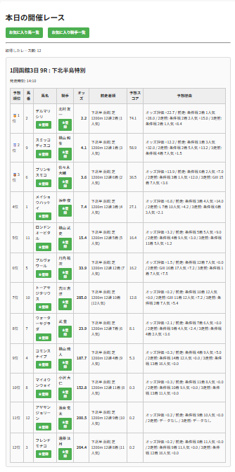
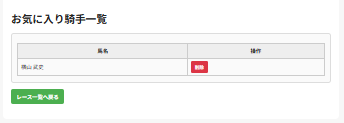
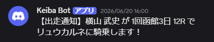

# Keiba App

## 概要

競馬の出馬表を取得し、過去走データやオッズを分析して独自予想スコアを算出する競馬予想Webアプリです。

お気に入り馬・騎手の管理機能やDiscord通知機能も実装しており、レース情報の取得から予想結果の出力までを一貫して行えます。

JavaおよびSpring Bootの学習とポートフォリオ作成を目的として開発しています。

現在はサービス分割・テストコード整備・Docker対応を進めながら継続的に改善を行っています。

---

## 工夫した点

- Yahoo!競馬へのアクセス回数削減のため30分キャッシュを実装し、レスポンス速度と負荷を改善
- 過去走データ取得結果をMapでキャッシュし、同一馬への重複スクレイピングを防止

---

## 起動方法
### Docker Composeで起動

```bash
docker compose up -d
```

ブラウザで以下へアクセス

http://localhost:8080/races

## 主な機能
### 出馬表取得
- Yahoo!競馬から出馬表を取得
- レース一覧表示
- レース情報キャッシュ（30分）

### 過去走分析
- 各馬の過去3走を取得
- 着順
- 人気
- レースグレード（GI/GII/GIII/L/OP/条件戦）

を収集

### 予想機能

独自ロジックにより予想スコアを算出

評価項目例

- 前走着順
- 前走人気
- レース格
- オッズ

予想理由も表示

### CSV出力

- 予想結果をCSV形式で出力

出力例
```text
レース名
馬名
予想スコア
予想順位
```

### お気に入り馬管理
- 登録 
- 一覧表示 
- 削除 
- 重複防止

### お気に入り騎手管理
- 登録 
- 一覧表示 
- 削除 
- 重複防止

### Discord通知
- お気に入り馬の出走通知 
- お気に入り騎手の騎乗通知 
- 重複通知防止 

### 定期実行
Spring Schedulerによる自動チェック

---

## 使用技術

| 技術 | 内容 |
|--------|--------|
| Java | 21 |
| Spring Boot | 3.3 |
| Spring Data JPA | ORM |
| Thymeleaf | テンプレートエンジン |
| PostgreSQL | 本番DB |
| H2 Database | テスト・開発用 |
| Jsoup | スクレイピング |
| Maven | ビルド管理 |
| Docker | コンテナ化 |
| Docker Compose | 開発環境構築 |
| Discord Webhook | 通知機能 |
| Git / GitHub | バージョン管理 |

---

## 開発規模

- サービスクラス: 6クラス
- 単体テスト: 18件
- Gitタグ管理: v1.0 ～ v1.7
- Docker / PostgreSQL 対応

---

## システム構成

```text
Yahoo!競馬
      ↓
    Jsoup
      ↓
 WebScraper
      ↓
 RaceService
 ┌───────────────┬────────────────┐
 ↓               ↓                ↓
RaceParser  HorseEnrichment  RaceCache
                 ↓
          PredictionService
                 ↓
             Thymeleaf
                 ↓
             CSV出力
```

```text
お気に入り馬・騎手
        ↓
    H2 Database
        ↓
RaceNotificationService
        ↓
 Discord通知
```

---

## テスト

JUnit5による単体テストを実施

- PredictionServiceTest
- OddsParserTest
- RaceParserServiceTest
- RaceCacheServiceTest
- HorseEnrichmentServiceTest

合計18テスト（全件成功）

---

## 画面イメージ

### レース一覧画面



### お気に入り管理画面



### Discord通知



---

## 学習した技術

本アプリ開発を通じて以下を学習しました。

- Java基礎 
- オブジェクト指向設計 
- Spring Boot 
- Spring Data JPA 
- HTML/CSS 
- スクレイピング（Jsoup） 
- Git/GitHub 
- Schedulerによる定期実行 
- Discord Webhook連携 
- CSV出力処理

---

## 今後の改善予定
- AWSデプロイ
- REST API化
- GitHub Actionsによる自動テスト
- 予想ロジック精度向上
- テストコード拡充
- 通知機能強化

---

## 開発目的

JavaおよびSpring Bootの学習を目的として開発しています。

実際の競馬データを利用し、

- スクレイピング 
- データベース操作 
- Webアプリ開発 
- バッチ処理 
- 外部サービス連携

を一つのアプリケーションで経験することを目標として開発しました。